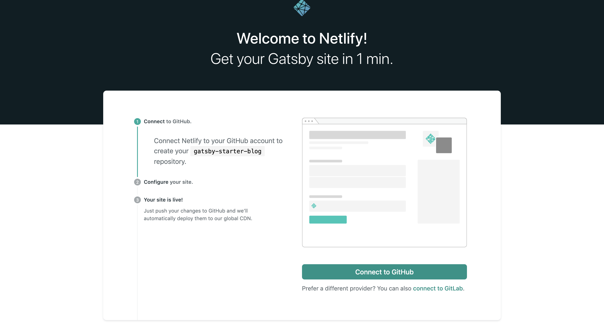

#はじめに
React も Gatsby.js も初心者っす。３日くらいまえに始めました。備忘録&僕みたいな人へ向けての記事です。僕もつまったところもあるからダメだーってなった人はﾂｲｯﾀｰに連絡してちょ。

#Gatsby.js の準備
プロジェクトのインストール

```
# GatsbyのCLIをインストール
npm install -g gatsby-cli

# プロジェクトの作成
# gatsby new [プロジェクト名] [GatsbyのテンプレートのGitHubのurl]
gatsby new gatsby-starter-blog https://github.com/gatsbyjs/gatsby-starter-blog

```

#Netlify の準備
この URL にアクセスしてデプロイする準備をしよう。
https://app.netlify.com/start/deploy?repository=https://github.com/gatsbyjs/gatsby-starter-blog

こんな画面になるかと


ここからぽちぽちやると github の連携＆リポジトリの作成までやってくれますん。

#git にあげてデプロイしよう！！

```
cd [作成したGatsbyのプロジェクト名]
git init
git remote add origin [さっき作ったgithubのレポジトリのURL]
git push origin master
```

add して push!

```
git add .
git commit -m "cmmon baby"
git push -u origin master
```

Netlify からサイトにアクセスしてみて！うまく行ってれば自動でデプロイしてくれてるはずだから！

＃そんな感じ。。。
そんな感じっす。React 始めたばっかなのでこれからカスタマイズしていこう！がんばろう。レイアウトが初期状態だったら全然進んでないってことでっす。
わからないことあったら twitter でも instagram にでもメッセージ送ってくれ！
